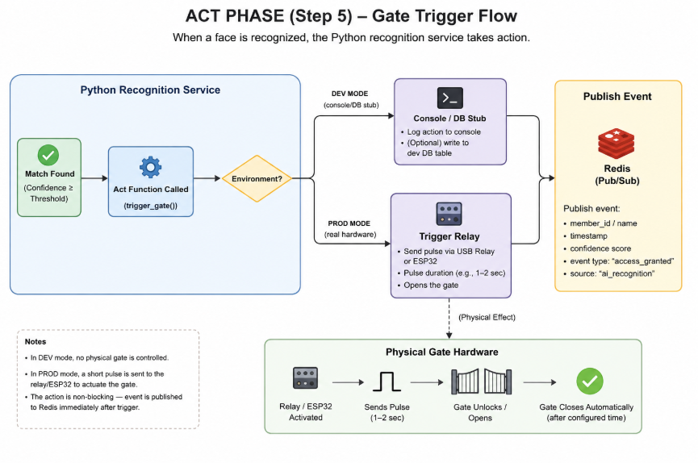

# Face Recognition-Based Automatic Gate Access System

**Full Project Plan — Home Electric Gate Automation**

## 1. Project Overview

**Goal:** Use a camera feed to detect and recognize family members' faces in real time. When a recognized family member is at the gate, the system automatically triggers the gate to unlock/open — no manual remote or button press needed.

**Core idea:** A laptop acts as the "brain." It pulls a video feed, runs face recognition on each frame, and when a match is found, sends a signal through a relay to trigger the gate. The camera source is just one line of code (`cv2.VideoCapture(...)`), so the entire software architecture — recognition, backend, dashboard, database — stays identical whether the input is your laptop's built-in webcam, a USB capture card connected to your analog CCTV camera, or a network IP camera stream.

**Development strategy:** Build and fully validate the whole system first using your laptop's built-in webcam — zero hardware cost. Once face recognition accuracy, the dashboard, and the gate-trigger logic are all working and tested, swap in the real camera and relay hardware. Only the camera source line and the gate-trigger function change; everything else carries over untouched.

### 1.1 How It Works — End-to-End Flow

1. **Capture** — The camera (webcam in dev, capture card/DVR in production) feeds frames to the Python recognition service via `cv2.VideoCapture()`.
2. **Detect** — Each frame is scanned for faces using InsightFace's detector.
3. **Embed & Match** — Every detected face is converted into a numeric embedding and compared (cosine similarity) against the embeddings of all enrolled family members.
4. **Decide** — If the best match's confidence clears the configured threshold, it's a recognized member; otherwise it's logged as "unknown."
5. **Act** — On a match, the recognition service calls the gate-trigger function (a console/DB stub in dev, a real relay pulse via USB relay/ESP32 in production) and publishes an event to Redis.
6. **Notify** — The Nest.js backend subscribes to that Redis event, writes an access-log row to PostgreSQL, and pushes the event over WebSocket to the Next.js dashboard, which updates the Live Status Panel and Access Log instantly.
7. **Fail-safe** — The physical remote/wall switch and the dashboard's manual unlock button work independently of this pipeline at every stage, so a crashed AI service never locks anyone out.

### 1.2 Why the Work Is Phased This Way

Each phase exists to isolate risk and defer spending. Phases 0–1 prove the entire software stack — recognition accuracy, backend, dashboard — on hardware you already own, at zero cost. Phase 2 is a decision checkpoint: it only makes sense to spend money once you know whether your gate is already motorized. Phases 3–4 move the already-proven software onto real hardware and harden it for unattended 24/7 operation. Phase 5 validates accuracy safely in shadow mode before the system is trusted to actually unlock the gate. Phase 6 is steady-state operation. This ordering means the expensive or hard-to-reverse decisions (which relay bridge to buy, whether to install a motor) happen only after the cheap, fully reversible software work has already been de-risked.

## 2. Phases

### 2.1 Phase 0 — Software-First Build on Webcam (Week 1–2, zero hardware cost)

**Status: Complete** — see [docs/phase0.md](docs/phase0.md) for full details, setup instructions, and known limitations.

**Objective:** Prove the full recognition pipeline works end to end using only the laptop's built-in webcam.

**Sub-tasks:**
- [x] Install Ubuntu (or continue on the current OS for early dev) and set up a Python virtual environment
- [x] Install core dependencies: OpenCV, InsightFace (or DeepFace), numpy, and a lightweight local store for embeddings (a file or SQLite is fine before Phase 1's Postgres exists)
- [x] Write a capture script that opens the webcam via `cv2.VideoCapture(0)` and displays the live feed with an FPS counter
- [x] Integrate InsightFace's face detector into the capture loop to draw bounding boxes on detected faces
- [x] Build an enrollment script: capture 5–10 photos per family member from different angles/lighting, generate and store their face embeddings tagged with name
- [x] Implement the recognition loop: detect face → generate embedding → compare against all enrolled embeddings (cosine similarity) → return best match + confidence score
- [x] Define a configurable confidence threshold (not hardcoded) for the accept/reject decision
- [x] Build the "gate trigger" function as a stub: logs `"GATE WOULD OPEN for [Name]"` with a timestamp to the console and to a local log/DB — this is the exact function Phase 3 swaps to a real relay call, with no other code changes
- [x] Build a small labeled test set (known faces + unknown faces) and measure false-accept/false-reject rates at a few threshold values to pick a starting default
- [x] Document environment setup (`requirements.txt`, run instructions) so Phase 1's backend can call into this service

### 2.2 Phase 1 — Backend & Dashboard (Week 2–3, still zero hardware cost)

**Status: Complete** — see [docs/phase1.md](docs/phase1.md) for architecture, API/WebSocket/Redis contracts, env vars, and test results.

**Objective:** Wrap the recognition service with a backend, database, and dashboard so events, logs, and enrollment are manageable from a UI instead of the terminal.

**Sub-tasks:**
- [x] Scaffold the Nest.js project (modules: members, access-events, auth)
- [x] Design the PostgreSQL schema: `members` (profile), `embeddings` (per-member face vectors/metadata), `access_logs` (timestamp, member, confidence, snapshot path, action taken)
- [x] Set up migrations (TypeORM/Prisma) for the schema above
- [x] Implement REST endpoints: member CRUD, access-log listing with filters, manual gate-trigger endpoint
- [x] Implement a WebSocket gateway for pushing live recognition events to connected dashboard clients
- [x] Wire Redis pub/sub between the Python recognition service and the Nest.js backend: the recognition service publishes on every match/unknown event, the backend subscribes and relays to WebSocket clients and writes to Postgres
- [x] Scaffold the Next.js dashboard and connect it to the backend's REST/WebSocket APIs
- [x] Build the Live Status Panel (camera snapshot, gate status, manual unlock button)
- [x] Build the Access Log page (table, date/person filters, snapshot preview)
- [x] Build the Family Members page (list, add-member flow that triggers enrollment capture, disable/remove toggle)
- [x] Build the Alerts panel (unknown-face banner, system health indicators)
- [x] Add basic authentication so the dashboard isn't reachable by anyone on the network
- [x] Run a full end-to-end test: webcam feed → recognition → simulated trigger → event appears live on the dashboard and in the access log

### 2.3 Phase 2 — Gate Check & Hardware Decisions (Week 3)

**Objective:** Turn the physical constraints of your specific gate into a concrete, budgeted hardware list before spending anything.

**Sub-tasks:**
- [ ] Inspect the gate in person: look for a motor box (sliding gates) or hinge-post motor (swing gates); confirm motorized vs. manual per Section 6, Step 1
- [ ] Test the existing remote/wall switch and note how its wiring is accessed (needed for the relay tap-in in Phase 3)
- [ ] Decide capture path — USB capture card vs. DVR+RTSP — based on where the laptop will physically sit relative to the camera (Section 6, Step 2)
- [ ] Decide relay bridge — USB relay vs. ESP32+relay — based on the distance between the laptop and the gate motor (Section 6, Step 3)
- [ ] If the gate is fully manual, evaluate motor vs. solenoid/electromagnetic lock feasibility based on gate weight and swing vs. slide design (Section 6, Step 5)
- [ ] Finalize the parts list and budget using the Section 6, Step 4 cost tables
- [ ] Order the hardware

### 2.4 Phase 3 — Hardware Migration (Week 3–4)

**Objective:** Move the already-proven software from the webcam onto the real camera and relay hardware, one swap at a time.

**Sub-tasks:**
- [ ] Install/confirm the capture card driver, or confirm the DVR's RTSP URL; verify the stream opens in OpenCV before touching the recognition code
- [ ] Swap the camera source in config (webcam index → capture card index or RTSP URL) and re-verify recognition accuracy on the real feed
- [ ] Wire the relay's NO contacts in parallel with the existing push-button wires (or flash and wire the ESP32 if using that bridge) — this simulates pressing the wall push-button, since switch-controlled gate motors are self-locking and don't need a separate lock
- [ ] Replace the stub gate-trigger function with the real trigger call (pyserial command to the USB relay, or a call to the ESP32)
- [ ] Add a cooldown period (10–15 seconds) after each real trigger so one visit doesn't fire the relay repeatedly
- [ ] Wire and test the manual override (physical push-button and/or dashboard toggle) so it works independently of the AI/recognition pipeline
- [ ] Mount the camera and relay hardware outdoors in a weatherproof enclosure and run the cabling
- [ ] Run a live walk-up test end to end: recognized face → real relay fire → gate physically opens

### 2.5 Phase 4 — Reliability & Hardening (Week 4–5)

**Objective:** Turn a working prototype into something that survives unattended, 24/7, outdoor operation.

**Sub-tasks:**
- [ ] Write systemd unit files for the Python recognition service and the Nest.js backend with `Restart=always`
- [ ] Disable laptop sleep/hibernate; disable lid-close suspend if running with the lid shut
- [ ] Write a watchdog script that checks the recognition process is alive and the video feed isn't frozen (stale last-frame timestamp); auto-restart the service if either check fails
- [ ] Register the watchdog itself as a systemd service/timer so it survives reboots
- [ ] Configure laptop BIOS to auto-power-on after a power outage; confirm the router and DVR (if used) have the equivalent setting, since they're upstream dependencies
- [ ] Size and install a small UPS for the laptop and networking gear; test how long it actually rides out a power cut
- [ ] Set up log rotation for the recognition/backend services so logs don't fill the disk over months

### 2.6 Phase 5 — Testing & Field Trial (Week 5–6)

**Objective:** Prove real-world accuracy without risk, before the system is trusted to actually control the gate.

**Sub-tasks:**
- [ ] Deploy in shadow mode (recognition + logging only, real trigger disabled) for 1–2 weeks outdoors
- [ ] Review shadow-mode logs regularly for false positives/negatives and note the conditions around each miss
- [ ] Test across lighting conditions: daylight, dusk, full IR/night mode, rain/fog if applicable in your climate
- [ ] Test edge cases: masks, sunglasses, hats, and more than one person approaching together
- [ ] Define and implement fallback behavior for low-confidence detections (e.g. require manual entry instead of guessing)
- [ ] Load-test relay pulse timing against your specific gate motor's requirements
- [ ] Re-tune the confidence threshold using real trial data before considering go-live

### 2.7 Phase 6 — Go-Live & Ongoing Maintenance (Ongoing)

**Objective:** Run the system live and keep it accurate over time.

**Sub-tasks:**
- [ ] Disable shadow mode and switch to live gate triggering
- [ ] Set a recurring (weekly) cadence to review dashboard logs for false positives/negatives
- [ ] Schedule periodic re-enrollment (every few months, or immediately after a major appearance change — new beard, glasses, hairstyle)
- [ ] Periodically check hardware health: relay cycle wear, camera lens/cabling, UPS battery condition

## 3. Requirements

### 3.1 Functional

- Real-time face detection and recognition from a live video feed (webcam during development, real camera in production — interchangeable via a single config line)
- Automatic gate unlock trigger on recognized match
- Manual override (dashboard button + physical fallback)
- Access logging with timestamp, matched name, confidence score, and snapshot image
- Family member enrollment/management interface

### 3.2 Non-functional

- 24/7 uptime with auto-recovery from crashes or reboots
- Recognition latency under ~2 seconds from face appearing to gate trigger
- Secure remote access to dashboard (not exposed openly to the internet)
- Fail-safe: if the AI service crashes, gate must still be operable manually — never lock family members out

## 4. Tech Stack

| Layer | Technology | Why |
|---|---|---|
| Video capture & detection | Python, OpenCV | `cv2.VideoCapture()` reads from webcam (dev), USB capture card, or RTSP stream (prod) with only the source argument changing |
| Face recognition | InsightFace (recommended) or DeepFace | InsightFace gives better accuracy/speed tradeoff on CPU-only hardware (no GPU needed on an old laptop) |
| Camera source (production) | USB video capture card (BNC-to-USB) for your existing analog CCTV camera | Cheapest path since you already own the camera; laptop must sit near the camera. A DVR + RTSP is the alternative if the laptop needs to be elsewhere on the network |
| Hardware bridge | USB relay module, or ESP32 + relay via pyserial | Plain USB relay if the laptop sits near the gate motor (simpler, cheaper); ESP32 adds Wi-Fi if the laptop stays indoors away from the gate |
| Relay | 1-channel 5V relay module | Wired in parallel with the gate motor's existing push-button circuit — simulates a button press, no separate lock needed |
| Backend API | Nest.js + TypeScript | Matches your existing stack, easy to maintain |
| Database | PostgreSQL | Store member profiles, embeddings metadata, access logs |
| Real-time events | Redis pub/sub + WebSocket | Push live "gate opened" events to dashboard without polling |
| Dashboard | Next.js + React | Matches your stack |
| Process management | systemd | Native Linux service management, auto-restart on crash/boot |
| OS | Ubuntu Server (Linux) | Lightweight, stable for headless 24/7 operation |

## 5. Dashboard Design

**Main sections:**

**5.1 Live Status Panel**
- Current camera feed thumbnail (snapshot refresh every few seconds, not full live stream, to save bandwidth)
- Gate status: Locked / Just Opened / Manual Override Active
- Big "Manual Unlock" button (with confirmation)

**5.2 Access Log**
- Table: Timestamp | Matched Name | Confidence % | Snapshot | Action Taken (Auto-opened / Denied / Manual)
- Filter by date range / person
- Snapshot thumbnail click-to-expand

**5.3 Family Members**
- List of enrolled members with profile photo
- Add new member (capture/upload photos → re-train embeddings)
- Remove/disable a member (e.g. temporarily block someone without deleting their profile)

**5.4 Alerts & Notifications**
- Unknown face detected at gate (optional: push notification via Telegram/WhatsApp — see future features)
- System health: camera offline, recognition service down, relay unresponsive

**5.5 Analytics (simple)**
- Chart: entries per day/week
- Chart: most frequent visitors
- False-positive/negative flagging (mark a log entry as wrong to improve future tuning)

## 6. What You Actually Need to Buy

You currently have a laptop and a basic analog (BNC/coax) CCTV camera. Development (Phases 0–1) needs zero new hardware — it all runs on the laptop's built-in webcam. The purchases below are only needed once you move to Phase 2/3 (real hardware). The one thing that massively changes your budget is whether your gate is already motorized.

### 6.1 Step 0: Development phase — buy nothing yet

Build and fully test the software using the laptop's webcam first (see Phases 0–1). Confirm recognition accuracy and dashboard functionality before spending anything.

### 6.2 Step 1: Check if your gate already has a motor

Before buying anything, confirm this:

- Look for a metal motor box near the gate track (sliding gates) or near the hinge post (swing gates) — roughly shoebox-sized.
- If you already use a remote control or wall switch and the gate physically moves on its own (motor hum, not just a latch click) — you have a motor.
- If you currently push/pull the gate open by hand every time — it's fully manual, no motor.

If your gate already opens via a wired wall switch/push-button, you have a motor with a self-locking gearbox — you do not need to buy a separate lock. The motor holds the gate shut mechanically; your relay just needs to mimic pressing that existing button (wire the relay's NO contacts in parallel with the button's wires). This is by far the cheapest and simplest case.

### 6.3 Step 2: Camera hardware — using your existing analog CCTV camera

| Option | Cost (PKR) | Notes |
|---|---|---|
| USB BNC-to-USB video capture card | 2,500 – 6,000 | Cheapest — camera plugs straight into the laptop's USB port, read via OpenCV like a webcam. Laptop must sit near the camera. Match the card to your camera's signal type (CVBS/AHD/TVI/CVI). |
| DVR (camera → DVR → network RTSP) | 5,000 – 10,000+ (DVR box) | Only needed if the laptop must sit elsewhere on the network, or you want multi-camera/recorded storage later. |

### 6.4 Step 3: Relay bridge — connecting the laptop to the gate

| Option | Cost (PKR) | Notes |
|---|---|---|
| USB relay module | 500 – 1,500 | Simplest — plugs directly into the laptop via USB, controlled with serial commands. Best if the laptop sits near the gate motor. |
| ESP32 + relay module | 1,200 – 2,000 | Adds Wi-Fi so the relay can sit at the gate while the laptop stays indoors. Slightly more setup (flashing firmware), but avoids a long USB/serial cable run. |

### 6.5 Step 4: Cost Breakdown (PKR) — Two Gate Scenarios

| Component | Scenario A: Gate already has a motor | Scenario B: Fully manual gate |
|---|---|---|
| USB capture card (using existing camera) | 2,500 – 6,000 | 2,500 – 6,000 |
| Relay bridge (USB relay or ESP32+relay) | 500 – 2,000 | 500 – 2,000 |
| Gate motor + installation | 0 (already exists — just wire into its push-button circuit) | 70,000 – 250,000+ (depends on gate weight, sliding vs. swing gate, brand) |
| Wiring, connectors, weatherproof enclosure | 1,500 – 3,000 | 2,000 – 4,000 |
| Basic UPS (laptop + camera backup power) | 3,000 – 8,000 | 3,000 – 8,000 |
| Miscellaneous (mounting hardware, cables, labeling) | 500 – 1,000 | 500 – 1,000 |
| **Total** | **~8,000 – 20,000 PKR** | **~78,500 – 271,000+ PKR** |

The gap is almost entirely the gate motor. Everything on the "smart" side — camera capture, AI recognition, relay trigger — stays cheap in both cases, and Scenario A got even cheaper than before now that a DVR/IP camera isn't required.

### 6.6 Step 5: A Cheaper Middle Ground (Scenario B alternative)

If a full motor (PKR 70,000+) feels excessive, consider an electromagnetic or solenoid gate lock (PKR 3,000 – 15,000) paired with a spring-assisted or gravity-swing gate design:

- The system electronically releases the latch when it recognizes a family member.
- The gate then swings open on its own weight/spring, or with a light push — no motor required.
- This only works if your gate is a lightweight swing gate. Heavy sliding gates generally need a real motor to move at all.

**Recommendation:** finish the webcam-based software build first (Step 0), confirm your gate type (Step 1), then pick the matching camera and relay options above before ordering anything.

## 7. Ongoing Maintenance Cost

| Item | Estimated Cost | Notes |
|---|---|---|
| Electricity (laptop running 24/7) | ~PKR 300 – 700/month | Depends on laptop's power draw (typically 20–40W idle-ish load) |
| Software/hosting | PKR 0 | Fully self-hosted, no cloud subscription needed |
| Occasional hardware replacement (relay wear, cables) | ~PKR 500 – 1,000/year | Relays are mechanical parts and can wear out over years of cycles |
| Optional: Telegram/WhatsApp API for alerts | PKR 0 (free tiers available) | |
| Optional: cloud backup of logs/snapshots | PKR 200 – 500/month | Only if you don't want to rely solely on local storage |

**Total ongoing cost:** roughly PKR 300 – 1,200/month, mostly just electricity — this is a very low-maintenance-cost system since everything runs locally.

## 8. Additional Features (Future Roadmap)

Once the core system is stable, you can layer on:

- Instant mobile notifications — Telegram or WhatsApp bot alert on every gate trigger or unknown face detection.
- Liveness / anti-spoofing detection — prevent someone from unlocking the gate with a photo held up to the camera.
- Guest/visitor QR or temporary access codes — for guests, delivery riders, etc., without full face enrollment.
- License plate recognition — combine with face recognition so cars are recognized too, useful if family members drive up rather than walk.
- Voice announcement — small speaker announces "Welcome home, [Name]" as the gate opens.
- Multi-camera support — add a second angle for better recognition accuracy in poor lighting/angles.
- Mobile app — a lightweight version of the dashboard for on-the-go monitoring and manual unlock.
- Battery-backed gate control — ensures the relay/ESP32 side keeps working briefly even during a power cut (separate from the main UPS).
- Visitor intercom integration — if someone unrecognized rings, live video call to your phone before deciding to let them in.
- Historical analytics dashboard — weekly/monthly summaries, busiest hours, etc.

## 9. Risk Notes & Fail-safes (Important)

- Never let this be the only way to open the gate. Keep the existing remote/manual button fully functional in parallel — the AI system should only ever be an additional trigger path, not a replacement.
- Test extensively in shadow mode before going live — a false "unknown" isn't dangerous, but a false "match" opening the gate to a stranger is a real security risk. Tune your confidence threshold conservatively (favor false rejections over false acceptances).
- Physical security of the laptop/relay box — since it controls a gate, it should not be easily accessible/tamperable from outside the property.
